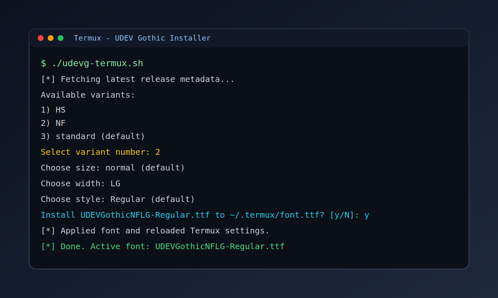

# UDEV Gothic Installer for Termux

Termux に UDEV Gothic を入れて `~/.termux/font.ttf` へ反映するインストーラです。



## Features

- Latest release を自動取得
- 必要な依存関係が不足していれば自動インストール（Termux）
- ダウンロード URL を `yuru7/udev-gothic` の release asset に限定
- release metadata に SHA256 digest がある場合は ZIP を検証（既定で有効）
- 対話モードで variant/family/size/width/style を選択
- `--preset` で一発指定（例: `nf`, `35nflg-bold`）
- ZIP キャッシュ対応（`~/.cache/udevgothic`）

## Quick Start

```bash
curl -fsSLo /tmp/udevg-termux.sh https://raw.githubusercontent.com/dev100kg/TUDEVG/main/udevg-termux.sh
bash /tmp/udevg-termux.sh
```

非対話で一発適用する場合:

```bash
bash /tmp/udevg-termux.sh --preset nf --yes
```

短縮ワンライナー（`curl | bash`, 非推奨）:

```bash
curl -fsSL https://raw.githubusercontent.com/dev100kg/TUDEVG/main/udevg-termux.sh | bash -s -- --preset nf --yes
```

ローカル実行:

```bash
chmod +x udevg-termux.sh
./udevg-termux.sh
```

## Options

```bash
./udevg-termux.sh [options]
```

- `-f, --font NAME` font file name を直接指定（完全一致 or 一意の部分一致）
- `-p, --preset PRESET` preset 指定（例: `nf`, `nflg`, `35nf`, `35nflg-bold`, `hs`）
- `-l, --list` 利用可能 package と preset 例を表示
- `-y, --yes` 確認プロンプトをスキップ
- `--no-verify` SHA256 検証をスキップ（非推奨）
- `--require-verify` SHA256 digest が取得できない場合はエラー終了
- `-h, --help` ヘルプ表示

## Preset Examples

```bash
./udevg-termux.sh --preset nf --yes
./udevg-termux.sh --preset nflg --yes
./udevg-termux.sh --preset 35nflg-bold --yes
./udevg-termux.sh --preset hs --yes
```

## Cache

- Cache dir: `~/.cache/udevgothic`
- 同じ ZIP は再ダウンロードせず再利用

```bash
rm -rf ~/.cache/udevgothic
```

## Notes

- `--font` と `--preset` を同時指定した場合は `--font` を優先
- 非対話実行時は `--yes` 推奨
- GitHub metadata に digest が無いアセットは、警告のうえ検証なしで続行（`--require-verify` で厳格化）
