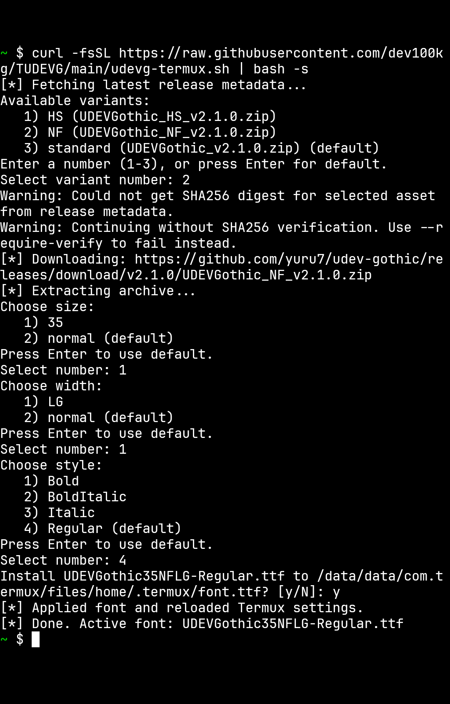

# UDEV Gothic Installer for Termux

Termux に UDEV Gothic をインストールし、`~/.termux/font.ttf` に適用するスクリプトです。



## このスクリプトでできること

- `yuru7/udev-gothic` の最新リリース ZIP を自動取得
- Termux で不足している依存コマンドを自動インストール
- SHA256 digest が取得できる場合は ZIP を検証（デフォルト有効）
- 対話形式でフォントを選択（family/size/width/style）
- `--preset` で一発指定（例: `nf`, `35nflg-bold`）
- ダウンロード済み ZIP をキャッシュ再利用（`~/.cache/udevgothic`）

## クイックスタート

```bash
curl -fsSL https://raw.githubusercontent.com/dev100kg/TUDEVG/main/udevg-termux.sh | bash -s
```

## 目的別の使い方

利用可能なパッケージや preset 例を確認したい:

```bash
curl -fsSL https://raw.githubusercontent.com/dev100kg/TUDEVG/main/udevg-termux.sh | bash -s -- --list
```

非対話実行:

```bash
curl -fsSL https://raw.githubusercontent.com/dev100kg/TUDEVG/main/udevg-termux.sh | bash -s -- --preset nf --yes
```

## preset の書き方

基本形:

`[35][nf|hs][lg][-bold|-italic|-bolditalic]`

例:

- `nf`
- `nflg`
- `35nf`
- `35nflg-bold`
- `hs`
- `35hslg-italic`

## オプション

```bash
./udevg-termux.sh [options]
```

- `-f, --font NAME`: フォントファイル名を直接指定（完全一致、または一意の部分一致）
- `-p, --preset PRESET`: preset 指定（例: `nf`, `35nflg-bold`）
- `-l, --list`: 利用可能 package と preset 例を表示して終了
- `-y, --yes`: 確認プロンプトをスキップ
- `--no-verify`: SHA256 検証をスキップ（非推奨）
- `--require-verify`: digest が取得できない場合はエラー終了
- `-h, --help`: ヘルプ表示

## 補足

- `--font` と `--preset` を同時指定した場合は `--font` が優先されます。
- 非対話環境では `--yes` がないと確認入力で停止します。
- digest が無いアセットは警告して続行します（`--require-verify` で失敗させることも可能）。
- 適用後は `termux-reload-settings` があれば自動実行、なければ Termux 再起動で反映されます。

## キャッシュ

- 保存先: `~/.cache/udevgothic`
- 同じ ZIP は再ダウンロードせず再利用

キャッシュ削除:

```bash
rm -rf ~/.cache/udevgothic
```
